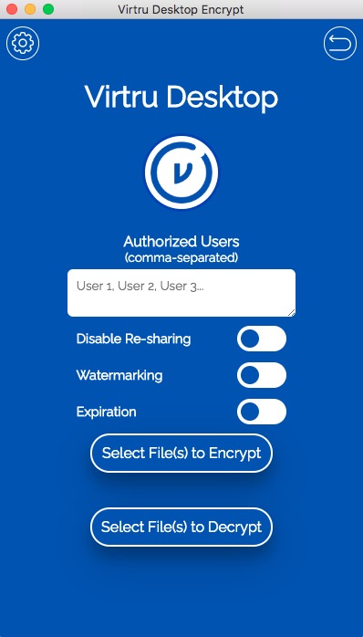
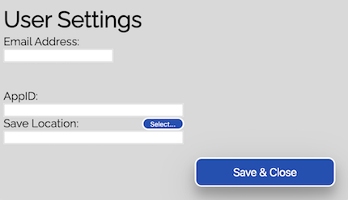

# Virtru Desktop Encrypt App

#### Written in nodejs using Electron

### Prerequisites
* Node v12+

### Install
* `git clone https://github.com/virtru/virtru-sdk-samples-electron.git`
* `cd virtru-sdk-samples-electron`
* `cd virtru-desktop-encrypt`
* `npm install -r requirements`

### Run
* `npm start`

### Usage

This app has two main functions:
* Encrypt (with security controls)
* Decrypt

And two helper functions:
* Input & save credentials (email & appId)
* Set & save output directory

When first launched, the app will show an error indicating that you do not have a valid appid / email combination.  Open the Settings menu via the gear icon in the top right to input your own email address and appid.  Credentials will be stored in the locations below:
* Mac
  * `~/Library/Application Support/virtru-electron-encrypt`
* Windows
  * `C:\Users\<you>\AppData\Local\virtru-electron-encrypt`
* Linux
  * `~/.config/virtru-electron-encrypt`

You can also specify the directory where you'd like encrypted & decrypted files to be saved from the settings page.

#### Encrypt
* Add authorized users, comma-separated (optional)
* Select access control policies (optional)
* Click "Select File(s) to Encrypt"
  * Multiple selections are supported
* File(s) will be encrypted and saved to the specified location (or to source directory if none specified)

#### Decrypt
* Click "Select File(s) to Decrypt"
  * Multiple selections are supported
* File(s) will be decrypted and saved to the specified location (or to source directory if none specified)

