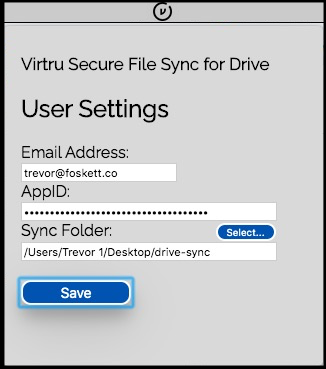

# Virtru Drive File Sync

#### Written in nodejs using Electron

### Prerequisites
* Node v12+
* [Drive API Enabled](https://developers.google.com/drive/api/v3/enable-drive-api) & credentials generated (see [Drive Node.js Quickstart](https://developers.google.com/drive/api/v3/quickstart/nodejs)).

### Install
* `git clone https://github.com/virtru/virtru-sdk-samples-electron.git`
* `cd virtru-sdk-samples-electron`
* `cd virtru-drive-sync`
* `npm install -r requirements`

## User Inputs
- **./.google/credentials.json**
  - Generated when [Drive API Enabled](https://developers.google.com/drive/api/v3/enable-drive-api).  Store in ./.google/.
- **./.google/folderId.json**
  - Input the folderId to which you'll be uploading secure content.  

### Run
* `npm start`

### Usage

This app has two main functions:
* Encrypt
* Upload to Drive

And two helper functions:
* Input & save credentials (email & appId)
* Set & save input directory

Before running the project, see "User Inputs" above.
When first launched, click the Virtru icon in your tray to open the settings page.  Enter your email address and appId, then specify the folder that you'd like to sync with Drive.

Once you've set up, any files dragged into your 

